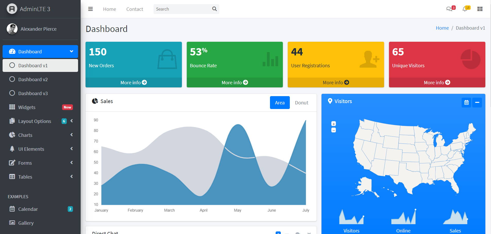

# dbproject

## Prerequisites
* Intellij IDEA
* VMware workstation
* Ubuntu 20.04.1 LTS
* Tools
  + Server : NodeJS Express with REST api
  + Database : MySQL (linux)
  + Page Template : EJS
  + Languages : HTML / CSS / JS
  + Maintenance : Docker (linux) & Github Desktop
  + Library & Module : AdminLTE 3.0 & DevExtreme
  
#### Reason Why Using Docker for Web Server
1) Manage & Maintain easily
2) Able to Test & Service at Everywhere & Anytime

* [Docker Install Method](https://docs.docker.com/engine/install/ubuntu/)
* [Docker Command Line](https://docs.docker.com/engine/reference/commandline/docker/)
* [Docker Architecture](https://docs.docker.com/get-started/overview/#docker-architecture)
* [Dockerfile syntax](https://tech.osci.kr/2020/03/23/91695884/)
  
## Let's Get Started
* [Install NVM on Ubuntu](https://tecadmin.net/how-to-install-nvm-on-ubuntu-20-04/)
* setting remote control function of IntelliJ : [IntelliJ Linux remote](https://jwj1699.tistory.com/15)
* [Use MySQL on NodeJS](https://medium.com/wasd/node-js%EC%97%90%EC%84%9C-mysql-%EC%82%AC%EC%9A%A9%ED%95%98%EA%B8%B0-1-b4b69ce7433f)

#### Install MySQL on Linux
~~~linux
$ apt-get install mysql-server mysql-client
$ service mysql start  
$ ps -ef | grep mysql
~~~
Check did MySQL installed well.

~~~linux
$ sudo mysql -u root -p
$ sudo mysqladmin -u root password [비밀번호]
~~~
option [-u] : refer user whose gonna logins 
option [-p] : ask password 
mysqladmin -u root password [비밀번호] : change [root]'s password 

~~~database
$ show databases;
$ create database [name];
$ use [db_name];
~~~
show databases : show current Databases. 
create database [name] : create new Databases. 
use [db_name] : use chosen Database. 

~~~database
$ create table [name] (
    ...datas
    ...constraints
);
$ show tables;
$ desc [table name];
~~~
create table [name] ( ...datas ) : in the DB, create table. 
show tables : in the DB, show tables. 
desc [table name] : describe a chosen table.  

#### Use AdminLTE3.0 & DevExtreme
* [DevExtreme Documentation](https://js.devexpress.com/Documentation/ApiReference/UI_Widgets/dxDataGrid/Configuration/editing/)
* [AdminLTE 3.0](https://adminlte.io/themes/v3/)

